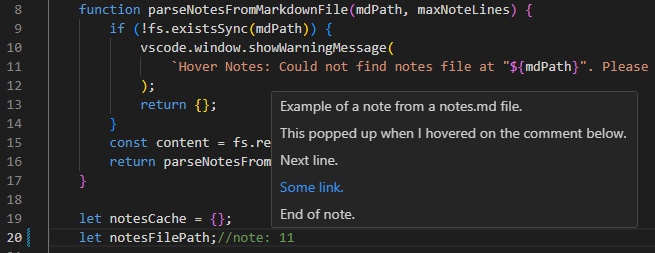

# README

Cross-reference relevant notes in your source code like below.



This extension pop-ups the note (in markdown format) as you hover over the cross-ref. Among other uses, I also use it to keep track code improvements (stuff that I wasn't aware of) suggested by AI.

## Supported Comment Styles
```
// Javascript, Java, C#, C, etc.
# python, bash, etc.
-- SQL, Haskell, etc.
; Lisp, Clojure, etc.Lisp, Clojure, etc.
```
## Requirements

Keep all your notes in one markdown file formatted as below. They may be cross-reference in any code file as `//note#<note-number>` or `# note:<note-number>` depending on the syntax of a single-line comment in your language.

```markdown
### 1
Note 1

### 2
Note 2.
Multiline.

### 3
Keep going.
```

Once you start cross-referncing notes in your code, you might want to include a directive like this in your CONTRIBUTING.md or equivalent file so that AI assistants don't remove your cross-refs.

```markdown
## Code Editing Guidelines

- **Do not remove or modify any comments that match note reference patterns (e.g., `// n#2`, `// note: 3`) when editing code.**
```

## Extension Settings

1. **Path to your notes file.** (Set this first.)
2. The cross-ref prefix you want to use. e.g. n, note, see, etc.
3. Line limit

## Known Issues

- Doesn't render images in the notes.

## Release Notes

Last Updated: Sept 2025

Please see the Change Log.

---